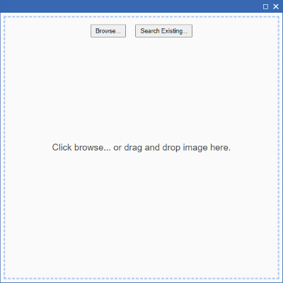
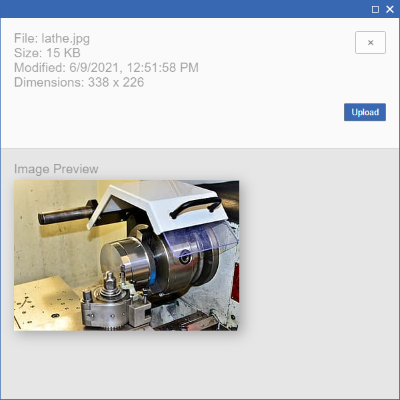

# Easy MPP Graphics

## Description

The goal of this package is to provide an easy way to add graphics to Aras Innovator's MPP Process Plans. Something more like what you can do in Office: quickly insert or drag & drop images while authoring the document.


### State of the Art

Out of the box with MPP, we can insert a new image into a process plan with the following steps:

1. Select `Graphics` in Aras Innovator TOC
2. Click `Create new Item` button (Graphics form appears)
3. Click `Select an Image...` (image upload dialog appears)
4. Choose `External File` tab
5. Browse for image location
6. Select image
7. Enter graphic number and name
8. Save, unlock, and close graphic form
9. Open (checked out) Process Plan 
10. Right-click on the work instruction detail
11. Choose `Insert Graphic`
12. Search for graphic by name

Although this approach makes sense for default behavior--it is simple and easily customized to the business use case--it does require quite a bit of extra ceremony each time a new image needs to be added. For instance, when adding graphics for a specific process plan, we may not need to reuse the image and thus care little about the Graphic number or name. We just want to add our image without the fuss.

Seems excessive? 💥 There must be a better way! <a href="#fn1"><span id="r1">[1]</span></a>

### Solution Approach

Instead of forcing the user to leave the process plan, we give them the ability to upload images from the process plan directly. After upload we automatically create a graphic and insert it into the process plan, identically to if the graphic had already existed. Now users can more easily add graphics while authoring process plans.


 

## Features

### **1. Upload graphics** directly from MPP Process Plan.

In the vanilla solution, `Insert Graphic` simply searches for an existing graphic. After installing this package, it will instead allow the user to upload and then directly insert an image into the process plan. The advantage of this is that it avoids the context switching caused by leaving the process plan, going to graphics, uploading the image, setting the number, etc. Now users can quickly upload the graphics when needed. The old behavior of searching for an existing graphic to insert is also still available.

### **2. Custom dialog** to allow drag & drop or manual selection of image files.

We use a custom dialog to add support for drag & drop of images from the users computer. We also support the ability to browse for images to upload from the dialog.

### **3. Preview image** and image information before uploading.

After an image file is selected, we show a preview of the image along with other metadata of the image file. This makes it easy to identify if the wrong image was selected or if the image needs more processing before uploading (eg. it is too big).

### **4. Automatic numbering and naming** of Graphic.

Since we start in the context of a process plan, we can use that to give the graphic a number that ties them together. The current behavior is to number the graphic as the process plan number combined with a timestamp. The Graphic name is populated from image file name. This behavior can be easily modified by updating the source code within this package. Search for `graphicPrefix` to see the relevant section.

## Project Details

**Built Using:**

Aras 11.0 SP9

**Versions tested:**

Aras 11.0 SP9

**Browsers Tested:**

Chrome 91.0, Microsoft Edge 91-93

## Installation

#### Important!
**Always back up your code tree and database before applying an import package or code tree patch!**

### Prerequisites

1. Aras Innovator installed (version 11.0 SPx)
2. MPP must be installed in the target database

### Install steps

#### Code Tree Installation
1. Backup your code tree and store the archive in a safe place
2. Navigate to your local `easy-mpp-graphics\` folder
3. Copy the `Innovator\` folder 
4. Paste this at the root of your install directory
+ By default this is `C:\Program Files\Aras\Innovator\`
5. Increment `cachingModule.filesRevision` in `Innovator\Client\web.config`

Now you should be able to use this package.

## Usage

1. Edit a Process Plan
2. Right-click a work instruction detail and choose `Insert Graphic`
3. Browse to select or drop an image file into the dialog
4. Click upload to confirm the selection

## Contributing

1. Fork it!
2. Create your feature branch: `git checkout -b my-new-feature`
3. Commit your changes: `git commit -am 'Add some feature'`
4. Push to the branch: `git push origin my-new-feature`
5. Submit a pull request


### Build Prerequisites

The dialog sources can be built using Node and Yarn (optional). 

 1. Nodejs
 2. Yarn (optional)

After installing the node and yarn, change to the `dialog-src` directory and install dependencies.
```
cd dialog-src
yarn
```

### Building

For running the dev server for development use
```
yarn dev
```
then go to [http://localhost:3000](http://localhost:3000). Features that require Innovator will call `window.alert` and show an error message. When run as a part of MPP they should work as expected. Therefore, to fully test the project, you must build and then copy the compiled app to the Innovator code tree and use from within MPP.

To create a production build use
```
yarn build
```
This compiles the the [Preact](https://preactjs.com/) dialog sources into `Innovator\Client\scripts\EasyGraphicUpload`. From there you can copy to the Aras Innovator code tree as described above.


### Testing
End-to-end tests are built using [cypress](https://cypress.io) and located in the `dialog-src\cypress\integration` subdirectory. These expect the dev server to be running so first start that with

```
yarn dev
```

Then in a separate command window start the tests.
```
cd dialog-src
yarn test
```


## Credits

Created by @haleytec for use with [PLMAccelerate](http://web.archive.org/web/20201126204707/https://www.infor.com/products/plm-accelerate) at [Watlow](https://www.watlow.com).

## Prior Art

The community package [Image Uploader for MPP and technical documents](https://github.com/AngelaIp/aras-image-uploader-for-tech-docs) by [AngelaIp](https://github.com/AngelaIp) provides a nice way to upload multiple images at once.</p>

## License

Published to Github under the MIT license. See the [LICENSE file](./LICENSE.txt) for license rights and limitations.

---

Footnotes

<p id="fn1"><a href="#r1">[1]</a> "There must be a better way!" A phrase often used by Raymond Hettinger while giving one of his excellent python talks. For example <a href="https://youtu.be/p33CVV29OG8?t=566">Modern Dictionaries by Raymond Hettinger, SF Python</a>.